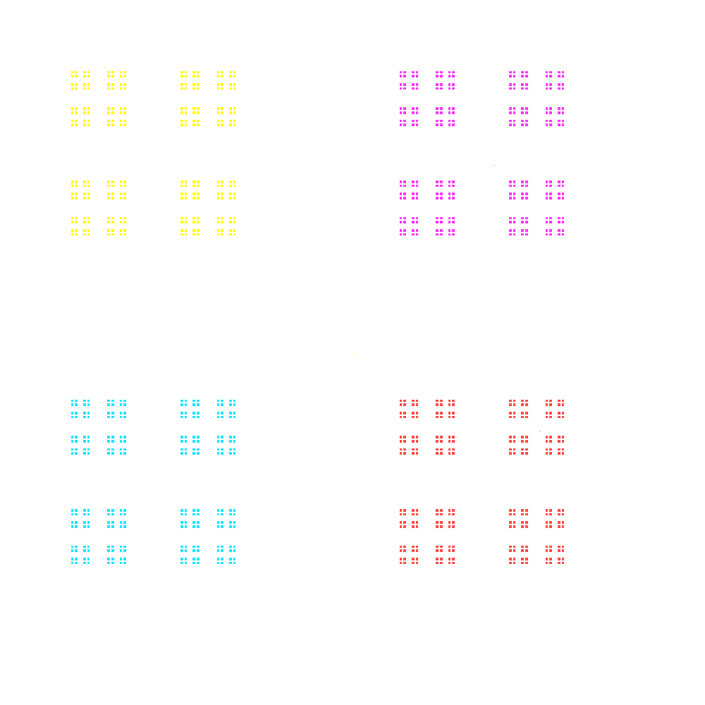

Example 1\
`cargo run -- -x 1000 -y 1000 -p 100 800 800 100 800 800 -d 2 -i 100000`\


Example 2\
`cargo run -- -x 1000 -y 1000 --points 100 100 100 800 800 100 800 800 -d 3 --iter 100000`\


Example 3\
`cargo run -- -x 2000 -y 2000 -e 10 -d 3 -i 500000`


Example 4\
`cargo run -- -x 10000 -y 10000 -e 10 -n 4 -d 5 -i 10000000`\


Example 5\
`cargo run -- -x 1000 -y 1000 -e 5 -n 3.3 -d 5.5 -i 100000`\


Using $\frac{n}{n+3}$ should yield an equidistant fractal structure

Example 6\
`cargo run -- -x 1000 -y 1000 -e 10 -n 10 -d 13 -i 10000000`\


Vicsek fractal\
`cargo run -- -x 2000 -y 2000 --points 0 0 1999 0 0 1999 1999 1999 1000 1000 -n 2 -d 3 --iter 10000000 --color 0,0,0`\


Sierpinski carpet\
`cargo run -- -x 2000 -y 2000 --points 0 0 1999 0 0 1999 1999 1999 0 1000 1000 0 1999 1000 1000 1999 -n 2 -d 3 --iter 10000000 --color 0,0,0`\


 ``Usage: chaos_game.exe [OPTIONS]``

 ```
 Options:
    -x <X>                         [default: 1000]
  -y <Y>                         [default: 1000]
  -e, --equidistant <PTS>        [default: 3]
  -p, --points <COORDINATES>...
  -n, --numerator <NUM>          [default: 1]
  -d, --denominator <DENO>       [default: 2]
  -i, --iter <ITERS>             [default: 10000]
      --color <COLOR>...         [default: 255 255 255]
  -h, --help                     Print help
  ```